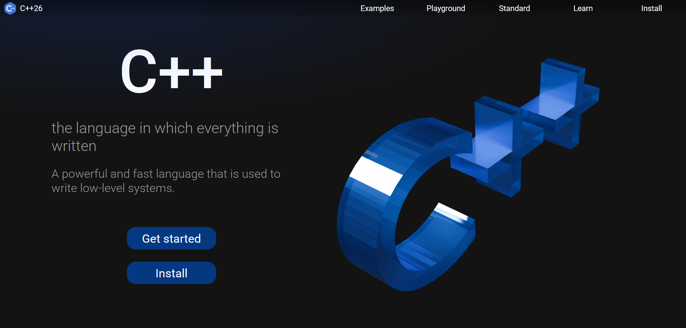

[//]: # (![]&#40;./public/logo.svg&#41;)
<div align="center"></div>

# C++ Site

---

## About the project



## Technologies
    
1. React
2. Typescript
3. NextJs
## Installation

1. Clone repository
```shell
git clone https://github.com/opie-official/CPP-Site.git
```
2. Install dependencies
```shell
npm i
```
3. Run
```shell
# dev
npm run dev
# or build
npm run build
```

